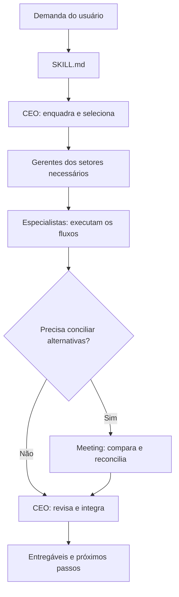

<div align="center">

# CeoSkill

### Uma empresa organizada em prompts. Um CEO para coordenar o trabalho.

Ecossistema de instruções em Markdown para transformar demandas de negócio em análises, decisões e entregáveis, usando o Codex com gerentes e especialistas por setor.


[Como funciona](#como-funciona) · [Começar](#começar) · [Setores](#setores-e-especialidades) · [Reuniões](#reuniões-entre-setores) · [Estrutura](#estrutura-do-repositório)

</div>

---

## Visão geral

O **CeoSkill** organiza o trabalho do Codex com uma estrutura empresarial: um CEO recebe a demanda, escolhe os setores relevantes, aplica os fluxos dos gerentes e revisa os resultados antes de entregar uma resposta integrada.

Cada setor possui um gerente e instruções especializadas. Quando uma decisão exige conciliar diferentes perspectivas, o fluxo de reunião compara alternativas, registra objeções e produz uma recomendação com condições e próximos passos.

O projeto é composto por arquivos Markdown. Os cargos representam responsabilidades de análise e coordenação. As ferramentas disponíveis no ambiente do Codex realizam pesquisa, cálculos, criação de arquivos e outras ações autorizadas.

## Como funciona

### 1. Entrada pela skill

O [SKILL.md](SKILL.md) define o nome `ceo`, os contextos de uso e o carregamento inicial do [ceo.md](ceo.md).

### 2. Enquadramento pelo CEO

O CEO identifica o objetivo, os entregáveis, as informações disponíveis, os limites de caixa e capacidade e a autorização existente. Em seguida, seleciona apenas os setores necessários.

### 3. Trabalho dos gerentes e especialistas

O gerente selecionado lê e aplica as instruções pertinentes do seu setor. Os resultados precisam conter o trabalho solicitado: uma proposta, análise, planejamento, texto, imagem ou outro entregável sustentado pelas ferramentas e evidências disponíveis.

### 4. Reunião quando necessária

O [meeting.md](meeting.md) organiza a avaliação de alternativas e conflitos entre setores. O CEO recebe o resultado para revisar as consequências e formular a recomendação final.

### 5. Revisão e entrega

O CEO verifica consistência entre escopo, custos, caixa, prazos, capacidade, evidências e requisitos aplicáveis. A saída apresenta os materiais solicitados, a recomendação, as limitações relevantes e as próximas ações.



O carregamento é progressivo: uma solicitação simples não precisa mobilizar os cinco setores ou abrir uma reunião.

## Começar

### Obter os arquivos

```bash
git clone https://github.com/BrayanDevZN/CeoSkill.git
cd CeoSkill
```

Mantenha o `SKILL.md`, o `ceo.md`, o `meeting.md` e a pasta `sectors/` juntos. Os links entre os prompts são relativos a essa estrutura.

### Usar diretamente no projeto

Com o repositório acessível no ambiente do Codex, envie:

> Leia o SKILL.md deste repositório e use o CeoSkill para avaliar minha empresa. Comece pelo ceo.md e aplique os setores necessários. Quero uma recomendação com ações concretas, considerando os dados que vou fornecer.

### Usar como skill registrada

Se o pacote estiver instalado e reconhecido no seu ambiente como `ceo`, invoque:

```text
$ceo Avalie as prioridades da minha empresa e prepare um plano de ação.
```

A presença dos arquivos no GitHub não instala a skill automaticamente. O registro e a instalação dependem do ambiente usado. O uso direto acima permite orientar a leitura dos arquivos sem presumir que ela já está registrada.

### Fornecer um contexto útil

Informe o objetivo, o serviço ou produto, o público, os recursos disponíveis, o horizonte e o resultado esperado. Acrescente documentos e decisões existentes quando forem relevantes.

Não é necessário fornecer dados em um formato técnico. Os prompts aceitam linguagem natural e normalizam os dados durante o trabalho.

## Setores e especialidades

| Setor | Gerente | Especialidades |
| --- | --- | --- |
| **Marketing** | [manager.md](sectors/marketing/manager.md) | Estratégia de aquisição, estratégia de conteúdo, copywriting, mídia paga e imagens para redes sociais |
| **Comercial** | [manager.md](sectors/commercial/manager.md) | Prospecção, qualificação de leads, diagnóstico comercial, propostas e precificação, negociação, follow-up e fechamento, gestão do funil |
| **Contabilidade e Finanças** | [manager.md](sectors/accounting/manager.md) | Escrituração, conformidade tributária, caixa e tesouraria, custos e preços, planejamento e análise financeira, folha de pagamento |
| **Jurídico** | [manager.md](sectors/legal/manager.md) | Contratos, privacidade e proteção de dados, publicidade e consumidor, propriedade intelectual, governança societária e pesquisa jurídica |
| **Administração** | [manager.md](sectors/admin/manager.md) | Melhoria de processos, planejamento operacional, gestão de projetos, compras e fornecedores, desempenho operacional e gestão de documentos/conhecimento |

São **cinco setores e 30 especialidades internas**. Os arquivos especializados são carregados pelos gerentes; não precisam ser registrados como 30 skills independentes.

## O papel do CEO

O CEO atua como integrador das decisões da empresa:

- Define o problema, a direção estratégica e as exclusões.
- Identifica o gargalo antes de recomendar novas iniciativas.
- Compara alternativas e seus custos de oportunidade.
- Distribui propostas de uso de dinheiro, tempo e capacidade.
- Coordena setores e reconcilia resultados incompatíveis.
- Estabelece responsáveis, indicadores, condições e critérios de revisão.
- Distingue recomendação, aprovação e execução efetiva.

O prompt inclui orientação para estratégias proporcionais ao tamanho da empresa, decisões com recursos limitados e revisão de iniciativas com critérios de continuidade ou interrupção.

## Reuniões entre setores

O `meeting.md` oferece quatro modos de trabalho:

| Modo | Resultado |
| --- | --- |
| **Workshop interno** | Análises por setor, comparação, objeções, síntese e recomendação |
| **Preparação de reunião real** | Pauta, material de contexto, papéis e plano de facilitação |
| **Registro de reunião real** | Ata ou resumo baseado nas notas e transcrições fornecidas |
| **Workshop com múltiplos agentes autorizados** | Contribuições reais dos agentes e síntese, quando o ambiente e a autorização permitirem |

O modo padrão é o **workshop analítico interno**. Ele aplica as instruções dos setores sem inventar pessoas reunidas, falas, votos ou aprovação profissional independente.

O fluxo percorre preparação, contribuições, comparação, revisão e fechamento. Pode explorar até três alternativas distintas quando isso ajuda a decisão. Divergências materiais permanecem no registro; uma condição não validada não desaparece para produzir consenso.

### Exemplo

```text
$ceo Use o meeting.md para comparar prospecção ativa, parcerias e anúncios.
Envolva Marketing, Comercial e Contabilidade.
Tenho R$600 para o teste e quatro horas semanais.
Entregue a comparação, a recomendação, os riscos e o plano do piloto.
Não envie mensagens nem lance campanhas.
```

## Exemplos de uso

### Proposta comercial

```text
$ceo Prepare uma proposta para automatizar um processo de atendimento.
Use Comercial e consulte os outros setores conforme as dependências.
Separe implantação, custos recorrentes, exclusões e critérios de aceite.
Marque como pendente o que ainda precisa de validação técnica.
```

### Planejamento operacional

```text
$ceo Organize a próxima semana.
Tenho 20 horas disponíveis, 12 horas de entregas contratadas e quatro
horas de rotinas. Avalie o que cabe no tempo restante sem assumir horas extras.
```

### Estratégia de aquisição

```text
$ceo Quero conquistar os primeiros clientes de um serviço de automação.
Avalie os segmentos e canais com os dados disponíveis.
Proponha um teste limitado, critérios de sucesso e condições para parar.
```

### Revisão entre setores

```text
$ceo Use o meeting.md para revisar esta oferta.
Compare valor para o cliente, margem, caixa, capacidade e riscos contratuais.
Entregue uma recomendação e registre as condições que ainda não foram verificadas.
```

## Estrutura do repositório

| Caminho | Função |
| --- | --- |
| [SKILL.md](SKILL.md) | Metadados e porta de entrada |
| [ceo.md](ceo.md) | Orquestração executiva e revisão integrada |
| [meeting.md](meeting.md) | Protocolo de reunião e decisão entre setores |
| `sectors/<setor>/manager.md` | Coordenação e revisão do setor |
| `sectors/<setor>/skills/*.md` | Instruções das especialidades |
| [README.md](README.md) | Apresentação e orientação de uso |

## Estrutura dos prompts

O ecossistema utiliza um padrão de instruções com:

- **Role:** responsabilidade e limites do papel.
- **Behavior:** práticas de trabalho e tratamento de evidências.
- **Constraints:** limites de escopo, autoridade e execução.
- **Input:** entrada livre e contexto necessário para o trabalho.
- **Problem-Solving Workflow:** sequência de execução.
- **Response Format:** resposta em linguagem natural, tabelas e entregáveis conforme o pedido.
- **Few-Shot Examples:** exemplos de aplicação e casos que exigem cuidado.
- **Professional Research Starting Points:** fontes iniciais para pesquisa.

As instruções são escritas em inglês. As respostas e os entregáveis seguem o idioma solicitado, ou o idioma do usuário.

Os prompts orientam raciocínio privado e apresentação de justificativas concisas, fontes e cálculos reproduzíveis. As análises dependem dos dados fornecidos e da pesquisa efetivamente realizada.

## Saídas esperadas

Conforme a demanda, o CeoSkill pode preparar propostas, planos de ação, análises financeiras, comparações, registros de decisão, pautas, textos e outros materiais.

O contrato de saída prevê **respostas em linguagem natural, tabelas e arquivos conforme o pedido**, incluindo evidências, hipóteses, lacunas, entregáveis e status de execução. Arquivos e ações externas dependem das capacidades disponíveis no ambiente.

Uma análise completa pode concluir que faltam informações para aprovar uma iniciativa. Nesse caso, o resultado deve identificar a condição pendente e concluir o trabalho que já é possível.

## Limites e uso responsável

O projeto organiza instruções; não inclui um servidor de agentes, CRM, conexão bancária ou execução autônoma de ferramentas próprias. Pesquisa, geração de imagens e operações externas exigem capacidades disponíveis no ambiente.

Ler um arquivo não executa a tarefa. Uma reunião interna não comprova aprovação humana. Recomendar uma campanha não autoriza seu lançamento. A atuação profissional e as obrigações legais reais precisam ser verificadas no contexto aplicável.

O ecossistema respeita as instruções e autorizações do usuário, protege informações sensíveis e exige clareza sobre o que foi preparado, aprovado ou efetivamente realizado.

## Evolução do projeto

Para acrescentar um setor, crie seu gerente e as especialidades necessárias, registre os caminhos no CEO e atualize a entrada da skill e esta documentação. Preserve o padrão dos prompts e verifique as referências relativas.

Novos setores devem resolver necessidades concretas de trabalho. A estrutura pode crescer sem exigir que todos os papéis sejam usados em cada tarefa.

---

**Criado por [BrayanDevZN](https://github.com/BrayanDevZN).**
